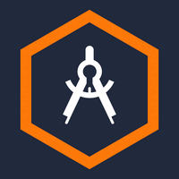

[](https://classroom.github.com/online_ide?assignment_repo_id=7942906&assignment_repo_type=AssignmentRepo)
<div id="top"></div>
<!--
*** Thanks for checking out the Best-README-Template. If you have a suggestion
*** that would make this better, please fork the repo and create a pull request
*** or simply open an issue with the tag "enhancement".
*** Don't forget to give the project a star!
*** Thanks again! Now go create something AMAZING! :D
-->

<!-- PROJECT SHIELDS -->
[![LinkedIn][linkedin-shield]][linkedin-url]

<!-- PROJECT LOGO -->
<br />
<div align="center">
  <a href="https://github.com/dyte-submissions/dyte-vit-2022-pranavraagz">
    
  </a>

<h3 align="center">Verne - Dyte VIT 2022 Task</h3>

  <p align="center">
    CLI Tool that validates dependency satisfaction accross multiple Github repositories and optionally updates them if necessary.
    <br />
    <a href="https://github.com/dyte-submissions/dyte-vit-2022-pranavraagz"><strong>Explore the docs »</strong></a>
    <br />
    <br />
    <a href="https://github.com/dyte-submissions/dyte-vit-2022-pranavraagz/issues">Report Bug</a>
    ·
    <a href="https://github.com/dyte-submissions/dyte-vit-2022-pranavraagz/issues">Request Feature</a>
  </p>
</div>


<!-- TABLE OF CONTENTS -->
<details>
  <summary>Table of Contents</summary>
  <ol>
    <li>
      <a href="#about-the-project">About The Project</a>
      <ul>
        <li><a href="#built-with">Built With</a></li>
      </ul>
    </li>
    <li>
      <a href="#getting-started">Getting Started</a>
      <ul>
        <li><a href="#prerequisites">Prerequisites</a></li>
        <li><a href="#installation">Installation</a></li>
      </ul>
    </li>
    <li><a href="#usage">Usage</a></li>
    <li><a href="#roadmap">Roadmap</a></li>
    <li><a href="#contact">Contact</a></li>
  </ol>
</details>


<!-- ABOUT THE PROJECT -->
## About The Project

[![Product Name Screen Shot][product-screenshot1]](https://example.com)
[![Product Name Screen Shot][product-screenshot2]](https://example.com)


<p align="right">(<a href="#top">back to top</a>)</p>


### Built With

* [Node](https://nodejs.org/en/)
* [TypeScript](https://www.typescriptlang.org/)

<p align="right">(<a href="#top">back to top</a>)</p>


<!-- GETTING STARTED -->
## Getting Started

To get a local copy up and running follow these simple example steps.

### Prerequisites

* npm
  ```sh
  npm install npm@latest -g
  ```

### Installation

1. Clone the repo
   ```sh
   git clone https://github.com/dyte-submissions/dyte-vit-2022-pranavraagz
   cd dyte-vit-2022-pranavraagz
   ```
2. Install NPM packages
   ```sh
   npm install
   ```
3. Build the cli 
   ```sh
   npm run build
   ```
4. Install it globally on your system (might require superuser)
   ```sh
   sudo npm install -g .
   ```

<p align="right">(<a href="#top">back to top</a>)</p>


<!-- USAGE EXAMPLES -->
## Usage
### Input format
```
$ verne <input>         <input> must be of form <name>@<version-number>
```
### Options (flags)
```
Options
--file, -i            Describe location of CSV (REQUIRED)
--update, -u          Update dependancies 
--clear               Clear logged in GitHub user 
--version             View version 
--help                View help
```
### Examples
#### Check if `axios@0.23.0` is satisfied by all repos in `input.csv`
```
verne -i input.csv axios@0.23.0
```
#### Check if `axios@0.23.0` is satisfied by all repos in `input.csv` AND update if not satisfied
```
verne -u -i input.csv axios@0.23.0
```
**_NOTE:_** <br/>
* Updates will not be made when version is satisfied. 
* Updates cannot be made on repositories with a pre-existing un-merged update PR made by the CLI. (attempting to doing so might crash the app)
* Major changes are not updated automatically (this is an intended feature) and will have to be done manually on a repo-by-repo basis due to its breaking nature. 
#### Force a login attempt
```
verne --clear -i input.csv axios@0.23.0
```

### Sample CSV files: 
#### From problem statement 
```csv
name,repo
dyte-react-sample-app,https://github.com/dyte-in/react-sample-app/
dyte-js-sample-app,https://github.com/dyte-in/javascript-sample-app
dyte-sample-app-backend,https://github.com/dyte-in/backend-sample-app
```
#### Testing dependency update on repo not owned by you
```csv
name,repo
reddit-backend-clone,https://github.com/pranavraagz/reddit-backend-clone
```
**_NOTE:_** For the above, consider  running with dependency `bcrypt@5.0.5` (anything higher than 5.0.1)

## Caveats (do not skip)
In case you have already made a PR on a repo **you do not own** using this tool, then attempting to make another (using --update) one might crash the tool during runtime due to an unhandled edge case. To overcome this, you could go to your Github profile and delete the forked repository (which in turn should delete the PR) and then try again. <br/>
Likewise on repos that **you own**, you might have to delete the newly created branch (which in turn should delete the PR) in order to be able to run the tool (using --update) on it again.
<p align="right">(<a href="#top">back to top</a>)</p>


<!-- FEATURES -->
## Features

- [x] Check for dependency satisfaction in public & private repos
- [x] Update dependencies
    - [x] In repos owned by user 
    - [x] In repos not owned by user (private repos will require the account to have prior access) 
- [x] Github login
- [x] Credential caching 
- [x] Read & Write CSV
- [x] Prevent updating dependency on major changes (breaking changes) 

<!-- ROADMAP -->
## Roadmap
- [ ] Allow creation of multiple PRs on same repo for different dependencies
- [ ] Handle cases where a package.json isn't present at all 
- [ ] Unit tests 
- [ ] Run as a Github Action 
- [ ] Tables with column word wrap to fit data in smaller terminal windows
- [ ] Empathetic CLI interactions (ask for input if not provided instead of exiting) 
- [ ] Colorful CLI (for easy distinguishability)
- [ ] Config cleanup upon uninstall  

<p align="right">(<a href="#top">back to top</a>)</p>


<!-- CONTACT -->
## Contact

Pranav Raaghav - pranavraagz@gmail.com

Project Link: [https://github.com/dyte-submissions/dyte-vit-2022-pranavraagz](https://github.com/dyte-submissions/dyte-vit-2022-pranavraagz)

<p align="right">(<a href="#top">back to top</a>)</p>


<!-- MARKDOWN LINKS & IMAGES -->
<!-- https://www.markdownguide.org/basic-syntax/#reference-style-links -->
[linkedin-shield]: https://img.shields.io/badge/-LinkedIn-black.svg?style=for-the-badge&logo=linkedin&colorB=555
[linkedin-url]: https://www.linkedin.com/in/pranav-raaghav-a7a115196/
[product-screenshot1]: images/screenshot1.png
[product-screenshot2]: images/screenshot2.png
